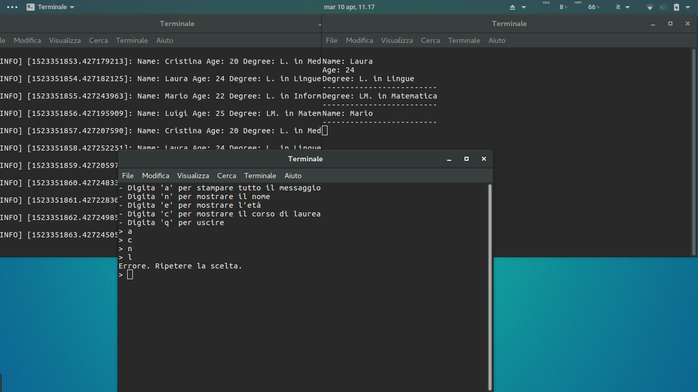

# ros_homework_1 #
##### Homework 1 [Laboratorio Ciberfisico] - University of Verona #####

### Rules (in italian) ###
*1.* Lo studente deve svolgere individualmente le attività previste nel testo dell’homework

*2.* Il codice dell’homework deve essere clonabile dal docente tramite un server Git

*3.* Il codice deve essere accompagnato da un file README.md contenente una descrizione della soluzione adottata per risolvere l’homework

### What it should do (in italian) ###
Si realizzi un package ROS contenente degli opportuni nodi 
per poter svolgere i compiti seguenti

* Un nodo pubblica, 1 volta al secondo, un messaggio contenente un nome, una età, e un corso di laurea 
* Un nodo permette di selezionare da tastiera quale parte del messaggio verrà mostrata a video (si veda la pagina seguente per i dettagli) 
* Un nodo mostra a video la parte del messaggio selezionata 

Il nodo che permette di selezionare da tastiera quale parte del messaggio mostrare dovrà comportarsi nel modo seguente:

* Digitando ‘a’ verrà stampato tutto il messaggio
* 'n’ mostrerà solo il nome
* ‘e’ mostrerà solo l’età
* ‘c’ mostrerà solo il corso di laurea

### Starting nodes ###
Before starting, you need to compile the package using the following command:
```sh
catkin_make --pkg ros_homework_1
```
Launch nodes using roslaunch command from your shell:
```sh
roslaunch ros_homework_1 ros_tutorial1.launch
```
or in addition (from your catkin_ws workspace) using a bash script:
```sh
src/ros_homework_1/launch/launch.sh
```

### How does it works ###
You can see that three nodes start together. Publisher sends on "message" topic a message wich contains different values per second. I use a message descriptor to send informations from publisher to selector (Message.msg wich contains a string field, an unsigned integer field and another string one). Selector node receives informations from the publisher, takes an user input and then selects values to be send to the visualizer node in a simple string message. This one just visualize the message to the screen using the ROS_INFO macro.

### Execution graphs ###
Publisher, selector and visualizer nodes communicate with each other using topics as you see in the picture: <br/>


I used also another topic to send a "kill" message from selector node to publisher and visualizer nodes because of I want to stop them if user choose [q] option (just to quit from the program): <br/>


<br/>...and then the final graph of the nodes execution is: 


### Execution screenshot ###


### References ###
[Course page (prof. Bloisi - Univr)](profs.scienze.univr.it/~bloisi/corsi/ciberfisico.html)

[Ros msg](http://wiki.ros.org/msg)

[Ros tutorials](http://wiki.ros.org/ROS/Tutorials)

### Author ###

* `Vladislav Bragoi`, University of Verona (Italy) [vladislav.bragoi@studenti.univr.it](mailto:vladislav.bragoi@studenti.univr.it)

### License ###

> MIT License
>
> Copyright (c) 2018 Vladislav Bragoi
> 
> Permission is hereby granted, free of charge, to any person obtaining a copy
> of this software and associated documentation files (the "Software"), to deal
> in the Software without restriction, including without limitation the rights
> to use, copy, modify, merge, publish, distribute, sublicense, and/or sell
> copies of the Software, and to permit persons to whom the Software is
> furnished to do so, subject to the following conditions:
> 
> The above copyright notice and this permission notice shall be included in all
> copies or substantial portions of the Software.
> 
> THE SOFTWARE IS PROVIDED "AS IS", WITHOUT WARRANTY OF ANY KIND, EXPRESS OR
> IMPLIED, INCLUDING BUT NOT LIMITED TO THE WARRANTIES OF MERCHANTABILITY,
> FITNESS FOR A PARTICULAR PURPOSE AND NONINFRINGEMENT. IN NO EVENT SHALL THE
> AUTHORS OR COPYRIGHT HOLDERS BE LIABLE FOR ANY CLAIM, DAMAGES OR OTHER
> LIABILITY, WHETHER IN AN ACTION OF CONTRACT, TORT OR OTHERWISE, ARISING FROM,
> OUT OF OR IN CONNECTION WITH THE SOFTWARE OR THE USE OR OTHER DEALINGS IN THE
> SOFTWARE.
 